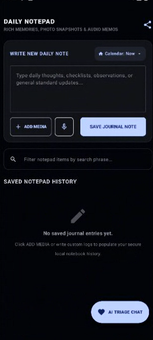

# BioSync HealthIntel (Daily Notepad)

**BioSync HealthIntel** is an intelligent, offline-first Android application designed to bridge the gap between decentralized patient journaling and clinically aware biometrics tracking. Developed by Shaurya Vikram Singh and Veer Vikram Singh, this tool allows users to maintain a robust, secure record of symptoms and telemetry to facilitate more accurate medical diagnoses and tackle multicomorbidity.

## Core Mission
Inspired by the challenges of monitoring elderly family members, this app serves as a medical investigation tool to track medication conflicts, symptom progression, and general wellness. It empowers users to provide physicians with high-fidelity telemetry during consultations, bridging the gap in elderly care through proactive health management.

## Key Features
*   **Intelligent Health Journaling:** Captures verbose symptom narratives and maps metrics such as blood glucose, blood pressure, and SpO2.
*   **AI Clinical Triage (RAG-Based):** Features an on-device, context-aware chatbot that utilizes Retrieval-Augmented Generation (RAG) on recent logs to provide a three-tiered diagnostic severity assessment (Normal, Intermediate, Serious).
*   **Secure Offline-First Persistence:** Built on Room SQLite to ensure patient confidentiality and data availability without requiring constant connectivity.
*   **Clinical Portability:** Includes a Compressed Export Utility to pack notes, voice memos (.3gp), and photos (.jpg) into secure, shareable .zip files, ensuring medical history is easily accessible by clinicians.
*   **Modern Android Architecture:** Engineered with Kotlin, Jetpack Compose (M3), and an MVVM design pattern for a responsive, high-performance user experience.

## Technical Stack
*   **Core Language:** Kotlin (v1.9+)
*   **UI Framework:** Jetpack Compose with Material Design 3
*   **Database:** Room SQLite (with KSP)
*   **AI Integration:** Google Gemini API with RAG framework
*   **Networking:** Retrofit 2 & OkHttp 3
*   **Testing:** Robolectric & Roborazzi
*   **Build System:** Gradle (Secrets Gradle Plugin)

## UI Preview

---
*Developed by Shaurya Vikram Singh and Veer Vikram Singh.*
